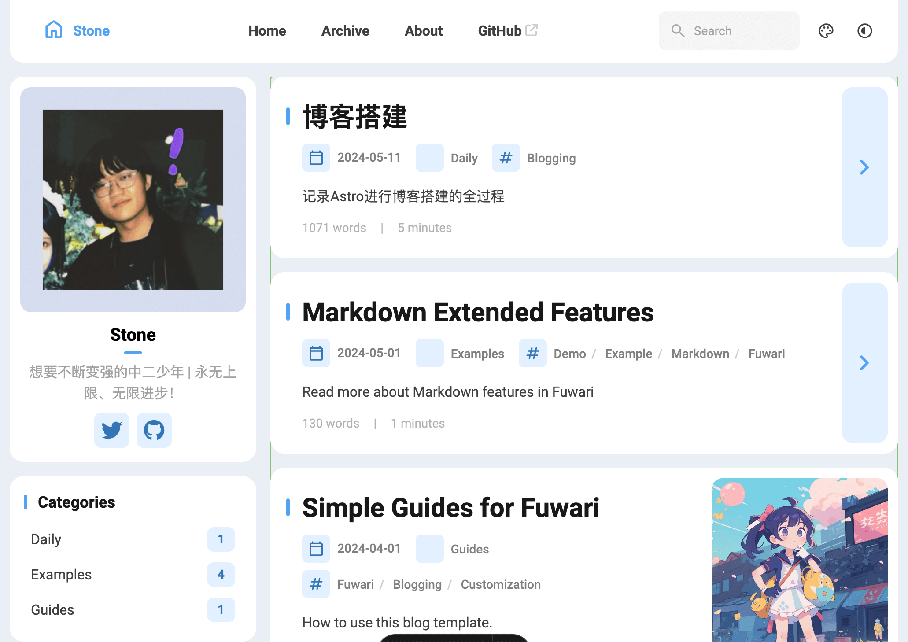

## Astro

我很喜欢看一些框架的官方官网给自己产品做出的一句话总结，它们干练、精简，Astro 也不例外。
来到[Astro](https://astro.build/)的官网，`What is Astro?`

> The web framework for content-driven websites.

Astro powers the world's fastest websites, client-side web apps, dynamic API endpoints, and everything in-between.

也就说明了，Astro 这款现代的前端框架，目的就是为了搭建快速的服务端 Web 应用。它高效、快捷、部署方面，甚至免费。本篇博客浅浅记录一下使用`Astro`配合`GitHub Pages`快速搭建博客的全过程。

## Quick start

参考文档：[Astro install](https://docs.astro.build/en/install/auto/) | [Astro deploy](https://docs.astro.build/en/guides/deploy/github/)

### 1. GitHub Pages

#### 基础碎碎念

[GitHub Pages 官方文档](https://docs.github.com/zh/pages/getting-started-with-github-pages/about-github-pages#types-of-github-pages-sites)

GitHub Pages 是一项静态站点托管服务，它直接从 GitHub 上的仓库获取 HTML、CSS 和 JavaScript 文件，（可选）通过构建过程运行文件，然后发布网站。

简单来说，`GitHub Pages`可以使用`github.io`域来构建自己或组织的站点。提供两种类型站点服务：

1. 个人或组织站点

- `User Site`: 必须创建名为 `<username>.github.io` 的个人帐户拥有的存储库。
- `Organization Site`: 若要发布组织站点，必须创建名为 `<organization>.github.io` 的组织户拥有的存储库。
- 除非使用的是自定义域，否则用户和组织站点在 http(s)://<username>.github.io 或 http(s)://<organization>.github.io 中可用。

2. 项目站点

> 上面的限制意味着，只能为`GitHub`上的每个账户创建一个用户或组织站点，当然`或`也就代表两者可以拥有，已亲自验证。项目站点（无论是组织还是个人帐户拥有）没有限制。

#### 创建一个仓库

创建一个自己 username 的仓库，我的 username 是`stonechin`，因此我创建了名为`stonechin.github.io`的仓库

#### clone 刚创建的库

Ciallo ～(∠・ω< )
在本地找到一个适合代码栖息的地方

```bash
$ git clone https://github.com/username/username.github.io
```

下面就可以进入到自己的项目并构建自己的博客了，我习惯使用`VS Code`作为编辑器

```bash
$ cd username.github.io
$ code . # 使用code打开当前文件夹
```

### 2. Astro

#### 安装 & 本地运行

```bash
$ npm create astro@latest
# 安装依赖
$ npm install
# 运行
$ npm run dev
```

#### 配置并部署

Astro 维护了一个官方的 GitHub Action withastro/action 来帮助部署项目；只需很少的配置，就可以完成部署。按照下面的说明可以将你的 Astro 站点部署到 GitHub Pages，如果你需要更多信息，请参阅该[README](https://github.com/withastro/action)。

1. 在 `astro.config.mjs` 中配置文件设置 `site` 和 `base` 选项。

```javascript
import { defineConfig } from "astro/config";

export default defineConfig({
  site: "https://username.github.io",
  base: "my-repo",
});
```

`site`: 基于你的用户名的网址：`https://<username>.github.io`

`base`: Astro 将该目录（例如 `/my-repo`）视为网站的根目录。

2. 配置 GitHub Action

项目中的 `.github/workflows/` 目录创建一个新文件 `deploy.yml`，并粘贴以下 YAML 配置信息。

```yaml
name: Deploy to GitHub Pages

on:
  # 每次推送到 `main` 分支时触发这个“工作流程”
  # 如果你使用了别的分支名，请按需将 `main` 替换成你的分支名
  push:
    branches: [main]
  # 允许你在 GitHub 上的 Actions 标签中手动触发此“工作流程”
  workflow_dispatch:

# 允许 job 克隆 repo 并创建一个 page deployment
permissions:
  contents: read
  pages: write
  id-token: write

jobs:
  build:
    runs-on: ubuntu-latest
    steps:
      - name: Checkout your repository using git
        uses: actions/checkout@v4
      - name: Install, build, and upload your site
        uses: withastro/action@v2
        # with:
        # path: . # 存储库中 Astro 项目的根位置。（可选）
        # node-version: 20 # 用于构建站点的特定 Node.js 版本，默认为 20。（可选）
        # package-manager: pnpm@latest # 应使用哪个 Node.js 包管理器来安装依赖项和构建站点。会根据存储库中的 lockfile 自动检测。（可选）

  deploy:
    needs: build
    runs-on: ubuntu-latest
    environment:
      name: github-pages
      url: ${{ steps.deployment.outputs.page_url }}
    steps:
      - name: Deploy to GitHub Pages
        id: deployment
        uses: actions/deploy-pages@v4
```

> 官方提供的 Astro GitHub Action 会扫描项目根目录下的 lockfile 以检测你首选的包管理器（npm、yarn、pnpm 或 bun）。应该将包管理器自动生成的 package-lock.json、yarn.lock、pnpm-lock.yaml 或 bun.lockb 文件提交到你的存储库。

正如我的项目在`GitHub Action`执行过程中就出现过了`Error: No pnpm version is specified.`的错误，需要我在项目重新安装一下 pnpm 或者直接更新`package.json`里指定一下`pnpm`版本，如下：

```json
{
  "name": "stone-blog",
  "packageManager": "pnpm@8.15.4",
  "type": "module",
  "version": "0.0.1",
  ...
}
```

#### push 到 GitHub 仓库

在修改完代码以后将代码 push 到仓库

```bash
git add .
git commit -m 'commit content'
git push
```

在自己的 GitHub 的`Action`中查看执行的 wrokflow 状态，执行成功后访问`https://<username>.github.io`

大功告成！

### 效果展示


